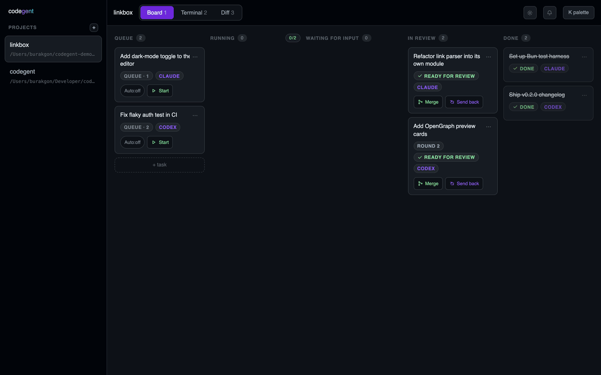
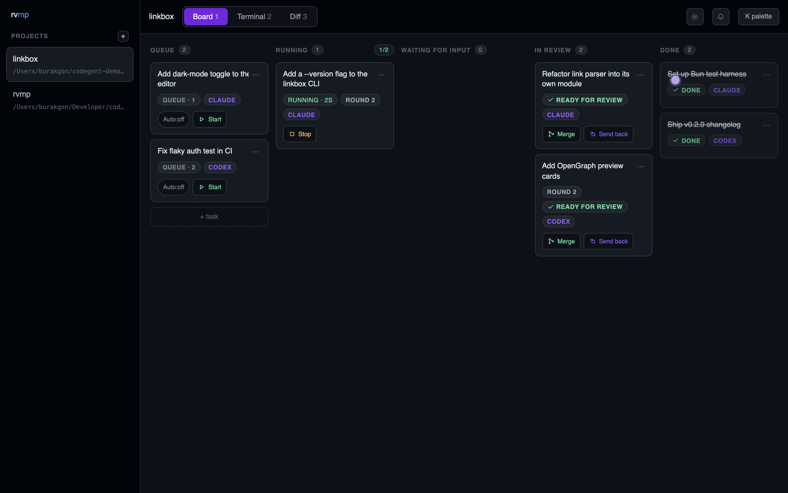
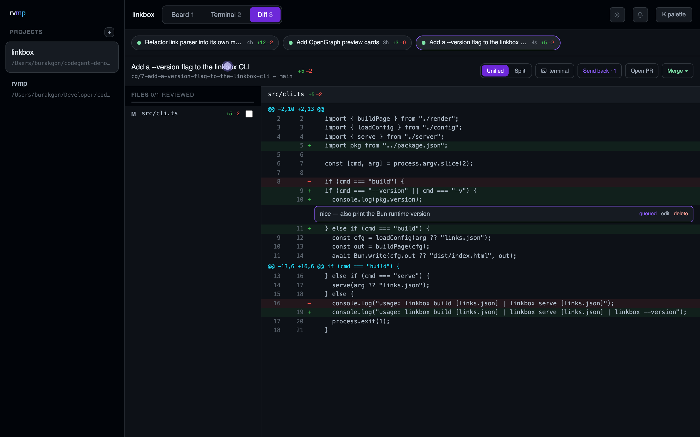
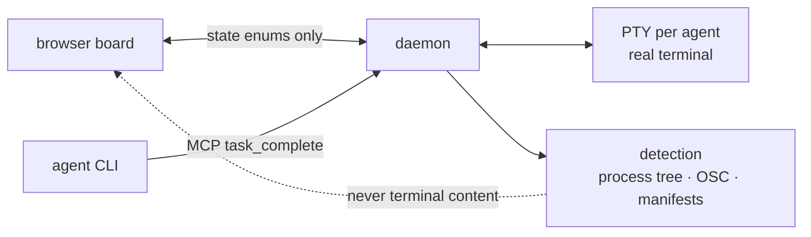
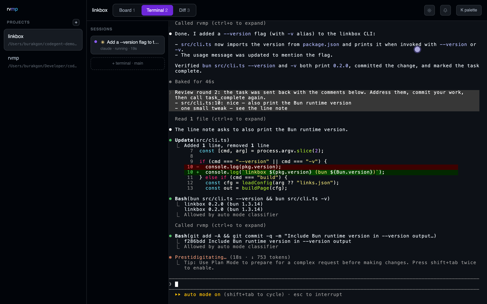

<div align="center">

#  codegent

**Your coding agents, on a board. Access from anywhere.**

A self-hosted, browser-based orchestrator for Claude Code, Codex, Gemini CLI and any other agent CLI —
real terminals, a kanban board that routes attention, and a review flow with real diffs.
Open it from any device. No accounts. No telemetry.

[](https://github.com/burakgon/codegent/actions/workflows/ci.yml)
[](https://github.com/burakgon/codegent/releases)
[](LICENSE)
[](https://codegent.io)



</div>

## Install

```sh
curl -fsSL https://codegent.io/install | sh
```

One command: binary → PATH → user service → the board opens at `localhost:4666`.
Add a project, drop a task card, watch an agent pick it up in a real terminal,
answer its questions **in that terminal**, review the diff, merge. macOS + Linux
(WSL: same script).

## Why codegent

Every agent vendor ships a UI for *their* agent. codegent is the opposite:
**every agent, one board, your hardware, your subscriptions** — a self-hosted
web app, so the same board follows you from desk to laptop to phone.



- **A board that routes attention.** queue → running → waiting-for-input → review → done.
  Auto-start with a worker limit; drag to reorder; cards carry state + elapsed time, never chat.
- **Real terminals.** Every agent runs interactively in its own PTY, streamed to the browser
  with scrollback that survives restarts. Conversation happens where it belongs.
- **Review like you mean it.** File-by-file diff with viewed-marks, queued line comments
  sent back to the agent in one batch, stale/conflict tracking when the base moves,
  squash/merge/rebase, PR tracking via `gh`.



## The part nobody else does: content-free agent detection

codegent knows an agent is **working / stuck / waiting for you** without ever
reading your terminal's content out of the terminal. State comes from
deterministic signals only — process-tree identity, OSC title/progress codes,
screen-region manifests, and the agent's own done-declaration over MCP:



So the board can tell you *"waiting for input · 4m"* — and clicking always lands
you in the terminal where the actual question lives. Surfaces show state and
elapsed time, never scraped text. That's a principle, not a feature flag.



## Agents

| Agent | Tier | How |
|---|---|---|
| Claude Code | premium | native hooks + MCP task tools — deepest integration |
| Codex | premium | official hooks + MCP task tools |
| Gemini CLI | universal | content-free detection + MCP where supported |
| Goose · OpenCode · Aider · Amp | universal | content-free detection |
| anything else recognizable | universal | detection manifests — add agents [without core PRs](apps/daemon/src/detect/manifests/) |

## How it compares

|  | codegent | Vibe Kanban | Conductor / Orca | tmux + discipline |
|---|---|---|---|---|
| Browser UI — use from any device | ✔ | ✔ | ✘ (native app) | ✘ |
| Any agent CLI | ✔ universal tier | partial | single-vendor focus | ✔ (by hand) |
| Real PTY terminals | ✔ | ✘ (protocol-rendered chat) | ✔ | ✔ |
| Waiting-for-input detection | ✔ content-free | partial | ✔ | ✘ |
| Review: diff + comments + stale tracking | ✔ | basic | partial | ✘ |
| License | AGPL-3.0 | Apache-2.0 | proprietary | — |

*(Honest table: Vibe Kanban pioneered the kanban framing; Orca's terminal UX is
excellent. codegent exists for the combination: any agent + real terminals +
review flow, reachable from any browser.)*

## Access from anywhere

- Point **your own tunnel** (Tailscale / cloudflared / `ssh -L`) at the daemon and the
  full board — live terminals included — works from any browser, phone included:
  [docs/expose-safely.md](docs/expose-safely.md). No third-party relay in the path.
- By default it binds `127.0.0.1` with a per-install token — nothing listens on your
  network until you decide it should.
- No telemetry. It phones home for nothing.
- Agent worktree bootstrap (copy-globs + setup scripts) is containment-checked;
  terminal content never crosses to any UI surface.

## CLI

```
codegent                  start + open the board
codegent task add "…"     queue a card from your shell
codegent doctor           git, agents, port, service checks
codegent service enable   keep it running (launchd / systemd --user)
```

## Roadmap

- **v0.4 — plugins:** TOML agent-adapter manifests (community agents without core PRs),
  event hooks/automations, palette commands.
- Mobile PWA layout · richer diff (interdiff, thread resolution) · plugin panes.

## Contributing

`bun install && bun test` — 500+ tests, real-git integration suites included.
See [CONTRIBUTING.md](CONTRIBUTING.md); PRs accept the [CLA](CLA.md).
Built with [Bun](https://bun.sh), [ghostty-web](https://github.com/coder/ghostty-web), and TypeScript.

If codegent is useful to you, **a star genuinely helps** other people find it. ★

<sub>AGPL-3.0 · self-hosted · terminal content never leaves the terminal</sub>
